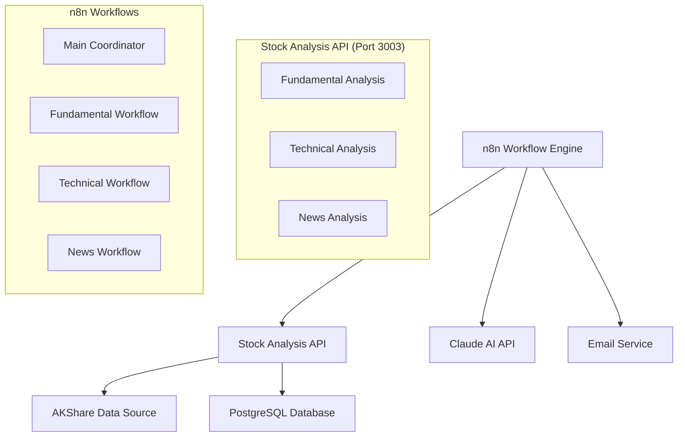

# 系统架构文档 / System Architecture

## 📋 架构概览 / Architecture Overview

股票分析服务是一个基于微服务架构的AI驱动金融数据分析平台，提供多维度的股票投资分析支持。

### 核心组件



## 🏗️ 技术栈 / Technology Stack

### 后端服务 / Backend Services
- **Python 3.8+**: 主要编程语言
- **FastAPI**: 现代、高性能的Web框架
- **AKShare 1.17.42**: 金融数据获取库
- **PostgreSQL**: 关系型数据库
- **Uvicorn**: ASGI服务器

### 工作流引擎 / Workflow Engine
- **n8n**: 可视化工作流自动化平台
- **Claude 4 Sonnet**: AI分析引擎
- **Gmail SMTP**: 邮件发送服务

### 开发工具 / Development Tools
- **Git**: 版本控制
- **Docker**: 容器化部署（可选）
- **GitHub**: 代码托管

## 🔧 系统组件详解 / Component Details

### 1. Stock Analysis API (api/stock_analysis_api.py)

**职责**：为n8n工作流提供结构化的股票数据API

**核心端点**：
- `/stocks/{stock_code}/analysis/fundamental` - 基本面分析
- `/stocks/{stock_code}/analysis/technical` - 技术面分析
- `/stocks/{stock_code}/news/*` - 消息面分析（4个子端点）

**数据源集成**：
- `akshare.stock_financial_abstract()` - 财务摘要数据
- `akshare.stock_individual_info_em()` - 股票基本信息
- `akshare.stock_zh_a_hist()` - K线历史数据
- `akshare.stock_bid_ask_em()` - 实时行情数据

### 2. n8n Workflow System

**主协调工作流** (workflows/main.json)
- 统一股票代码输入
- 并行调用3个子分析工作流
- 结果汇总和报告生成

**基本面分析工作流** (workflows/fund.json)
- HTTP请求获取财务数据
- Claude AI基本面分析
- 投资价值评估

**技术面分析工作流** (workflows/tech.json)
- HTTP请求获取技术指标
- Claude AI技术面分析
- 价格趋势预测

**消息面分析工作流** (workflows/news.json)
- 4个HTTP请求获取新闻数据
- Claude AI消息面分析
- 市场情绪评估

### 3. Data Flow Architecture

```
Stock Code Input → Main Workflow
                ↓
    ┌──── Fundamental API ←→ AKShare Data
    │     ↓
    │     Claude AI Analysis
    │     ↓
    ├──── Technical API ←→ AKShare Data  
    │     ↓                              
    │     Claude AI Analysis           
    │     ↓                          
    └──── News APIs ←→ AKShare Data    
          ↓                            
          Claude AI Analysis           
          ↓                          
    Result Aggregation                 
          ↓                          
    PostgreSQL Storage                 
          ↓                          
    HTML Email Report                  
```

## 🔒 安全架构 / Security Architecture

### API安全
- 输入验证和参数化查询
- SQL注入防护
- 错误处理避免信息泄露
- CORS策略配置

### 数据安全
- PostgreSQL连接池管理
- 敏感配置环境变量存储
- 数据库访问权限控制

### 网络安全
- 服务器IP白名单 (35.77.54.203)
- 端口访问控制 (3003, 3004, 3005)
- HTTPS支持（生产环境）

## 📊 性能架构 / Performance Architecture

### 数据缓存策略
- 股票基本信息：5分钟缓存
- 实时行情数据：1分钟刷新
- 财务数据：30分钟缓存

### 并发处理
- FastAPI异步支持
- n8n工作流并行执行
- PostgreSQL连接池优化

### 扩展性设计
- 微服务架构支持水平扩展
- API版本控制支持
- 数据库分片准备

## 🔄 部署架构 / Deployment Architecture

### 服务器配置
- **服务器IP**: 35.77.54.203
- **操作系统**: Linux (Ubuntu/CentOS)
- **Python环境**: 3.8+
- **数据库**: PostgreSQL

### 端口分配
- **3003**: 中国股票分析API
- **3004**: 美国股票API（预留）
- **3005**: 中国期货API（预留）

### 服务管理
```bash
# API服务启动
python3 -m uvicorn api.stock_analysis_api:app --host 0.0.0.0 --port 3003

# 后台运行
nohup python3 -m uvicorn api.stock_analysis_api:app --host 0.0.0.0 --port 3003 > logs/api.log 2>&1 &
```

## 🚀 扩展规划 / Extension Planning

### 短期扩展
- [ ] 消息面API实现（akshare接口稳定后）
- [ ] API响应缓存优化
- [ ] 错误监控和告警系统

### 中期扩展
- [ ] Web管理界面
- [ ] 实时WebSocket推送
- [ ] 多市场支持（美股、港股）

### 长期扩展
- [ ] 机器学习预测模型
- [ ] 移动端API支持
- [ ] 多租户系统支持

## 📝 监控和维护 / Monitoring & Maintenance

### 健康检查
```bash
# API健康状态
curl http://35.77.54.203:3003/

# 数据库连接测试
sudo -u postgres psql -c "SELECT version();"
```

### 日志管理
- API访问日志：`logs/api.log`
- 错误日志：`logs/error.log`
- n8n工作流日志：n8n管理界面查看

### 性能监控
- API响应时间监控
- 数据库查询性能分析
- 内存和CPU使用率监控